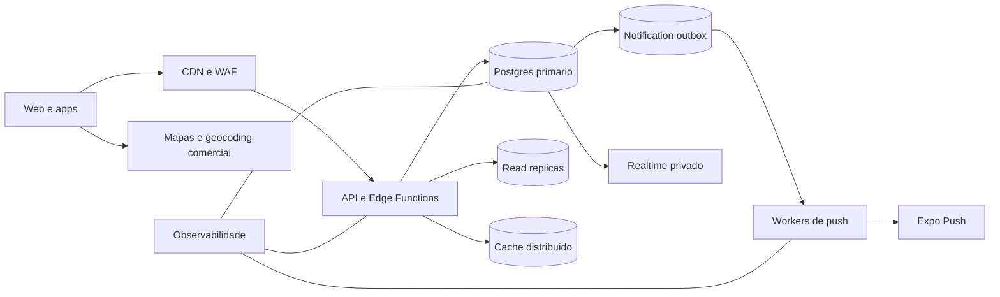

# Papaleguas: arquitetura para 25 milhoes de usuarios

## O que esta estrutura entrega

O repositorio passa a ter os componentes de software necessarios para crescer
sem transformar o banco em uma fila sincrona: busca paginada, reservas atomicas,
broadcast privado, outbox duravel para push, retencao e teste por taxa de
chegada. Isso e uma base de escala, nao uma garantia antecipada de 10 mil RPS.

Vinte e cinco milhoes de contas cadastradas e 25 milhoes de pessoas simultaneas
sao problemas muito diferentes. O dimensionamento deve partir de usuarios
ativos simultaneos, buscas por segundo, motoristas transmitindo localizacao,
reservas por segundo e assinantes por rota.

## Arquitetura alvo



## Fluxos criticos

**Busca de rotas.** `search_routes_page` usa cursor `(departure_time, id)`, limita
a pagina a 50 itens e devolve apenas os campos necessarios. Cache de borda pode
armazenar buscas anonimizadas por regiao e janela de tempo por 5 a 15 segundos.

**Reserva.** Continua no Postgres como transacao atomica. Nunca faca a leitura
do assento e a gravacao em duas chamadas do cliente. Chaves idempotentes devem
ser obrigatorias quando pagamentos forem adicionados.

**Localizacao.** O motorista grava somente sua posicao mais recente, com limite
autoritativo no banco. A entrega usa Broadcast privado no topico da rota. Com
intervalo de 8 segundos, 80 mil motoristas ativos geram aproximadamente 10 mil
gravacoes por segundo antes de qualquer outra carga; ajuste o intervalo por
movimento, estado da viagem e capacidade medida.

**Notificacoes.** Inserir a notificacao apenas cria um item em
`notification_outbox`. `process-push-queue` busca lotes com `SKIP LOCKED`, envia
ate 100 mensagens por chamada ao Expo e aplica retry exponencial. O envio nao
faz parte da transacao de reserva.

## Ordem de implantacao

1. Criar um projeto de homologacao com dados sinteticos e backups habilitados.
2. Aplicar as migracoes atuais na ordem documentada e, por ultimo,
   `migration_hyperscale_foundation.sql`.
3. Implantar o worker:

```powershell
npx supabase functions deploy process-push-queue --project-ref SEU_PROJECT_REF
npx supabase secrets set PUSH_WEBHOOK_SECRET="SEGREDO_ALEATORIO_FORTE" --project-ref SEU_PROJECT_REF
```

4. Desativar o webhook antigo que chama `send-push` diretamente. Configure um
   scheduler ou worker para chamar `process-push-queue` continuamente com o
   cabecalho `x-papaleguas-secret`. Dois workers novos podem rodar em paralelo,
   mas o worker novo e o webhook antigo nao devem processar a mesma notificacao.
5. Agendar `select public.run_data_retention();` diariamente pelo Supabase Cron.
6. Publicar web e APK somente depois da migracao, pois os clientes usam a RPC e
   os canais privados criados no banco.
7. Executar os patamares em `tests/load/README.md` e registrar resultados.

## Infraestrutura necessaria

- Supabase Enterprise com limites contratados para conexoes, Realtime, banco,
  transferencia e Edge Functions.
- Read replicas para consultas REST GET elegiveis; escritas, Auth, Storage e
  Realtime continuam no primario ou nos servicos correspondentes.
- Cache distribuido para buscas quentes, configuracao e rate limiting global.
- Provedor comercial de tiles e geocoding com SLA. Os endpoints publicos do
  OpenStreetMap e Nominatim nao sao infraestrutura de producao em alto volume.
- Workers de notificacao horizontalmente escalaveis. Respeite o limite do Expo
  ou contrate/implemente entrega direta com FCM e APNs.
- WAF, protecao contra abuso, limites por usuario/IP/dispositivo e gestao de
  segredos fora do aplicativo.

## SLOs e alarmes iniciais

| Sinal | Objetivo | Alarme |
| --- | ---: | ---: |
| Busca de rotas p95 | abaixo de 500 ms | acima de 750 ms por 5 min |
| Erros da API | abaixo de 1% | acima de 2% por 5 min |
| Reserva p95 | abaixo de 800 ms | acima de 1,2 s por 5 min |
| Outbox mais antigo | abaixo de 30 s | acima de 60 s |
| Outbox `dead` | 0 | qualquer crescimento |
| Conexoes do banco | abaixo de 70% | acima de 80% |
| CPU do banco | abaixo de 70% | acima de 85% |
| Replication lag | abaixo de 2 s | acima de 5 s |

Registre tambem IOPS, cache hit ratio, locks, filas de conexao, mensagens de
Realtime, tokens invalidos, resposta do provedor de mapas e custo por mil
viagens. Todo log deve usar identificador de correlacao e excluir placa, telefone,
token e localizacao precisa.

## Liberacao de 10 mil RPS

A meta so pode ser declarada atingida quando o ambiente contratado passa no
teste de 10 mil RPS por 60 minutos, no soak de 24 horas, em teste de falha de
worker/replica e em restauracao real de backup. O teste deve incluir a mistura
de trafego de producao, nao apenas busca: leitura, reserva, cancelamento,
localizacao, Realtime e push.

Antes da abertura nacional, execute um teste por regiao, defina RTO/RPO,
confirme LGPD, rode revisao de seguranca e ensaie rollback de banco e clientes.
